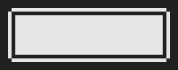
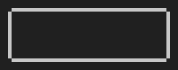
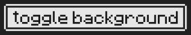
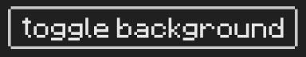
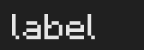

# chopstiqs

Chopstiqs aims to be a minimalistic GUI package for the [ebiten](https://ebitengine.org/) engine. Rather than using separate image files, it draws interface elements using built-in drawing functions. This allows for quick prototyping and use in projects that do not need polished graphics.

## Examples

Running example: <https://fglo.github.io/chopstiqs/>

### Checkbox

Unchecked checkbox: 

Checked checkbox: 

### Button

Not pressed button: 

Pressed button: 

Not pressed button with text: 

Pressed button with text: 

### Label

## Roadmap

What I want to achieve:

- unit tests for components
- sliders
- tooltips
- radiogroups
