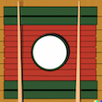

# chopstiqs

Chopstiqs aims to be a minimalistic GUI package for the [ebiten](https://ebitengine.org/) engine. Rather than using separate image files, it draws interface elements using built-in drawing functions. This allows for quick prototyping and use in projects that do not need polished graphics.

## Examples

Running example: <https://fglo.github.io/chopstiqs/>

## Components

- buttons
- checkboxes
- labels
- sliders
- containers
- container layouts
  - horizontal list
  - vertical list
  - grid

## Roadmap

What I want to achieve:

- more components:
  - text inputs
  - tooltips
  - radiogroups
  - modals and/or dialogs
  - range sliders
  - ...
- touchscreen support
- container layouts
  - vertical scroll
  - horizontal scroll
  - flexbox
- layers (mulitple containers on top of each other)
- tests for components
